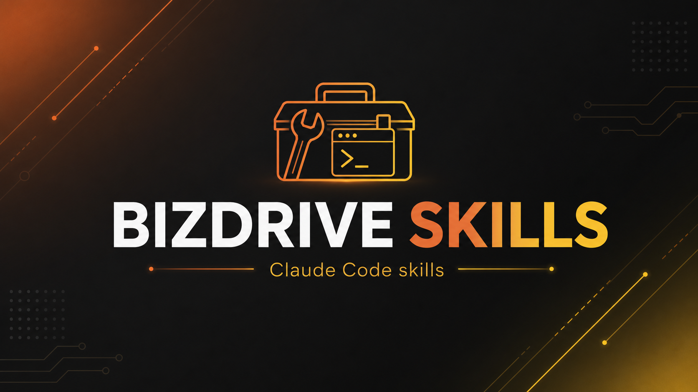

<div align="center">



### เครื่องมือเล็กๆ ที่ทำให้ทำงานกับ AI ลื่นขึ้น

[](https://claude.com/claude-code)
[](#-skills)
[](LICENSE)
[](#-ติดตั้ง)

</div>

---

## ✨ คืออะไร

รวม **skill ของ [Claude Code](https://claude.com/claude-code)** ที่ BizDrive (พี่แบงค์ปรัชญา) ทำขึ้นใช้เอง
แล้วเปิดให้ใครก็หยิบไปใช้ได้ — เป็น **user-level skill** ติดตั้งครั้งเดียว ใช้ได้ **ทุกโปรเจค**

> 💡 *Skill* คือคำสั่งลัด `/ชื่อสกิล` ใน Claude Code ที่สอน AI ให้ทำงานเฉพาะอย่างได้เก่งขึ้น

---

## 📦 Skills

| Skill | คำสั่ง | ทำอะไร |
|:--|:--|:--|
| **[save](save/SKILL.md)** 💾 | `/save` · `/save ต่อ` | บันทึกจุดที่ทำงานค้างไว้ ให้ session หน้าทำต่อได้ทันที — เก็บไฟล์ถาวร 1 ไฟล์ต่อ 1 โปรเจค ข้าม session ไม่หาย |

<sub>กำลังจะมีเพิ่มอีกเรื่อยๆ ⏳</sub>

---

## 🚀 ติดตั้ง

```bash
# 1) clone repo
git clone https://github.com/gobank01/bizdrive-skills.git

# 2) ก๊อปสกิลที่อยากได้ไปไว้ใน ~/.claude/skills/
cp -r bizdrive-skills/save ~/.claude/skills/
```

เปิด Claude Code แล้วพิมพ์ `/save` ได้เลย — ใช้ได้ทุกโปรเจคในเครื่อง

---

## 💾 ตัวอย่างใช้งาน — `save`

```text
จบงานวันนี้      →  พิมพ์  /save
                    AI เซฟ "งานค้าง" ลงไฟล์ของโปรเจคนั้น

เปิดมาทำต่อวันหลัง →  พิมพ์  /save ต่อ
                    AI อ่านสรุปขึ้นมาบรีฟ แล้วทำงานต่อจากจุดเดิม
```

- 🗂️ เก็บที่ `~/.claude/handoffs/<โปรเจค>.md` — แยกไฟล์ตามโปรเจคอัตโนมัติ
- ♻️ เขียนทับทุกครั้งที่เซฟ (ไฟล์ล่าสุด = ความจริงล่าสุด)
- 🔒 มีกฎห้ามเขียน API key / รหัสผ่าน ลงไฟล์

---

## 🤝 Contributing

อยากเสนอสกิลหรือแก้ไข เปิด [issue](https://github.com/gobank01/bizdrive-skills/issues) หรือ PR ได้เลย

## 📄 License

[MIT](LICENSE) © 2026 BizDrive (gobank01)

<div align="center"><sub>ทำด้วย ❤️ โดย BizDrive · #BizDrive #พี่แบงค์ปรัชญา</sub></div>
